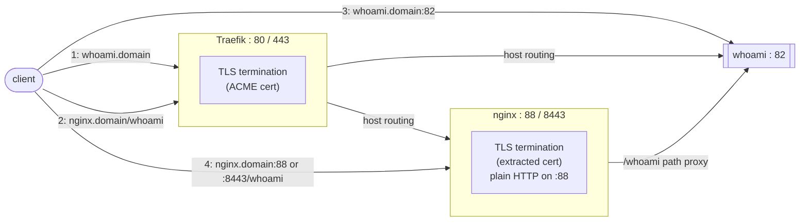

# Traefik + Domino NRPC Proxy Lab

Demonstrates [Traefik](https://traefik.io/) as a reverse proxy with automatic
ACME certificates, alongside an NGINX-based service
([nashcom/domino-nrpc-proxy](https://github.com/nashcom/domino-nrpc-proxy))
that terminates TLS itself by reusing the certificate Traefik obtained.
This is a reference setup for the pattern, not a hardened production
deployment - see [Security notes](#security-notes).

## TL;DR

```bash
cp env.example .env       # edit .env, set DOMAIN=your.domain
docker compose up -d
curl -k https://whoami.<domain>/
```

That's it - Traefik gets a certificate automatically and routes to `whoami`.
`-k` is needed because this defaults to the Let's Encrypt **staging** CA
(untrusted certs, see [ACME configuration](#acme-configuration)) - drop it
once you switch to production. Everything below explains how it works and
the other ways to reach it.

## Components

| Service | Image                | Purpose                                                            |
|---------|----------------------|--------------------------------------------------------------------|
| traefik | `traefik:latest`     | Reverse proxy, terminates TLS, obtains ACME certificates           |
| whoami  | `traefik/whoami`     | Simple echo backend for testing routing and headers                |
| nginx   | `domino-nrpc-proxy`  | [nashcom/domino-nrpc-proxy](https://github.com/nashcom/domino-nrpc-proxy), serves static content and proxies `/whoami` |

`nginx` runs [nashcom/domino-nrpc-proxy](https://github.com/nashcom/domino-nrpc-proxy)
in `PROXY_MODE=https` - the plain NGINX runtime (not Angie) with externally
managed TLS certificates, which is exactly the Traefik-issues/nginx-terminates
split this lab implements. The container's `entrypoint.sh` renders
`config/nginx.conf` as-is (it takes priority over the image's built-in
per-mode templates whenever mounted) and watches `/run/secrets/nginx` for
certificate changes, reloading nginx automatically. The custom error pages
referenced in `nginx.conf` (`/cfg/error_page_*.html`) ship inside the image
itself, not mounted from this repo.

All HTTP traffic on port 80 is redirected to HTTPS. Traefik routes by host name:

- `traefik.<domain>` - Traefik dashboard (`api@internal`)
- `whoami.<domain>`  - whoami container via Traefik
- `nginx.<domain>`   - NGINX container via Traefik

The certificate is requested by the dashboard router as a single certificate
with `<domain>` as the main name and the three sub domains as SANs.
The other routers reuse it via TLS SNI, which is why they only set
`tls=true` without their own `certresolver`.

## Ports

| Host port | Service | Notes                                        |
|-----------|---------|----------------------------------------------|
| 80        | traefik | HTTP entry point, redirects to HTTPS         |
| 443       | traefik | HTTPS entry point                            |
| 82        | whoami  | Direct access bypassing Traefik (testing)    |
| 88        | nginx   | Direct HTTP access bypassing Traefik         |
| 8443      | nginx   | Direct HTTPS access using the extracted cert |

## Prerequisites

- Docker with Compose plugin
- `jq` and `openssl` on the host (for the cert extraction script)
- DNS records for `<domain>`, `traefik.`, `whoami.` and `nginx.<domain>`
  pointing to the host
- Ports 80/443 reachable from the internet (Let's Encrypt TLS challenge)

## Quick start

```bash
cp env.example .env
# edit .env and set your domain
chown -R 1000:1000 config
docker compose up -d
```

The `nginx` service (`domino-nrpc-proxy`) runs as a fixed non-root account -
UID 1000, group `nginx` (created via `useradd nginx -U` in the image; this
is `domino-nrpc-proxy`'s own convention, not the UID 101 used by the
official `nginx:latest` image) - so `config/nginx.conf` needs to be
readable by UID 1000 on the host.
`traefik`'s image has no `USER` directive and runs as root, which bypasses
host permission checks on bind mounts entirely, so `data/` does not need
any special ownership. Git does not track directory ownership or
permissions, so this has to be run again after every fresh clone.

Traefik requests the certificate on first HTTPS access. Watch progress with:

```bash
docker logs -f traefik
```

Then see [Accessing whoami](#accessing-whoami) below to try the different
routing paths.

## Accessing whoami

The `whoami` container is reachable four different ways, which is a good
illustration of where each layer terminates TLS and how routing decisions
get made. `whoami` echoes back the request it received (method, path,
headers), so the response body itself shows which path was taken.



| # | Path                                | TLS terminated by -| Routing                        |
|---|-------------------------------------|--------------------|--------------------------------|
| 1 | Traefik -> whoami                   | Traefik            | Host-based (`whoami.<domain>`) |
| 2 | Traefik -> nginx -> whoami          | Traefik            | Host-based, then path-based (`/whoami`) inside nginx |
| 3 | direct to whoami, bypassing Traefik | none (plain HTTP)  | container's published port     |
| 4 | direct to nginx, bypassing Traefik  | nginx (extracted cert) or none | container's published ports |

Since DNS for `<domain>` and its subdomains already has to point at the
host (see [Prerequisites](#prerequisites)), the same hostnames work for
every path below - only the port changes. The examples use `curl -k`
because this lab defaults to the Let's Encrypt **staging** CA (see
[ACME configuration](#acme-configuration)); drop `-k` once switched to
production.

**1. Via Traefik, host-based routing:**

```bash
curl -k https://whoami.<domain>/
```

Traefik's own ACME certificate terminates TLS; the request reaches `whoami`
as plain HTTP inside the Docker network. The echoed `Host:` header is
`whoami.<domain>`.

**2. Via Traefik, then nginx (chained proxy, path-based):**

```bash
curl -k https://nginx.<domain>/whoami
```

Traefik terminates TLS and routes to `nginx` by host name; `nginx.conf`'s
`location /whoami` then proxies to the `whoami` container over the internal
Docker network. The echoed `Host:` header is `nginx.<domain>` (nginx
forwards `$host`, not the upstream's own name), and `X-Info:
routed-by-nginx-nrpc-proxy` is added - both are visible in the response,
confirming the request actually went through nginx.

**3. Directly to whoami, bypassing Traefik (port 82, plain HTTP):**

```bash
curl http://whoami.<domain>:82/
```

No TLS anywhere in this path - useful to confirm `whoami` itself is
healthy independent of Traefik or nginx. Only exposed for lab testing;
see [Security notes](#security-notes).

**4. Directly to nginx, bypassing Traefik (ports 88/8443):**

```bash
curl http://nginx.<domain>:88/whoami        # plain HTTP
curl -k https://nginx.<domain>:8443/whoami  # TLS via the extracted cert
```

Reaches `nginx` directly on its own published ports; TLS on 8443 is
terminated by nginx itself using the certificate copied out of Traefik's
ACME storage (see [Certificate extraction for NGINX](#certificate-extraction-for-nginx))
- this only works once `get_cert_for_nginx.sh` has been run at least once.

## Certificate extraction for NGINX

Traefik stores ACME state in `data/acme.json`, written by
[LEGO](https://github.com/go-acme/lego), the ACME client library Traefik
uses internally - not a Traefik-specific format. Under the resolver name
(`le` in this lab's config) it keeps the ACME account plus a
`Certificates[]` array, one entry per issued certificate:

```json
{
  "le": {
    "Account": { "...": "ACME account key, not a TLS cert" },
    "Certificates": [
      {
        "domain": { "main": "<domain>", "sans": ["traefik.<domain>", "..."] },
        "certificate": "<base64-encoded PEM certificate chain>",
        "key": "<base64-encoded PEM private key>"
      }
    ]
  }
}
```

The NGINX container terminates TLS itself on its direct port (8443), so it
needs that certificate and key as plain files, not embedded in this JSON.
Extract them with:

```bash
./get_cert_for_nginx.sh          # extract cert + key
./get_cert_for_nginx.sh cert     # additionally print the certificate
```

The script finds the `Certificates[]` entry by domain (main name or SAN,
default: `DOMAIN` from `.env`, override with `MATCH_DOMAIN=...`),
base64-decodes its `certificate` and `key` fields, and writes them to
`secrets/tls.crt` and `secrets/tls.key` as regular PEM files nginx can load
directly. It does not need to reload nginx itself: the container watches
`/run/secrets/nginx` for file changes and reloads on its own (within
`INTERVAL_SECONDS`, default 10s).

The `nginx` container runs as a fixed non-root account, UID/GID 1000
(`nginx`) - `domino-nrpc-proxy`'s own convention, not the UID 101 used by
the official `nginx:latest` image. If the script is run as root, it
`chown`s the extracted files to
`1000:1000` (override with `NGINX_UID`/`NGINX_GID`) so the container can
read `tls.key` despite its `600` mode. If run as a regular user, it can't
change ownership, so it falls back to making `tls.key` world-readable
instead and prints a warning - only acceptable on a host where that's fine.

Note: Let's Encrypt certificates are valid 90 days and Traefik renews them
~30 days before expiry, so the extraction has to be re-run after each
renewal - e.g. via cron.

## ACME configuration

The `le` resolver uses the TLS-ALPN challenge and EC256 keys. The CA is set
by `ACME_CASERVER` in `.env` (see `env.example`) and defaults to Let's
Encrypt **staging** when unset - staging certs are untrusted by
browsers/curl (hence `-k` throughout this doc) but have much higher rate
limits, which matters for a lab that gets spun up and torn down repeatedly.
Set `ACME_CASERVER=https://acme-v02.api.letsencrypt.org/directory` in
`.env` to switch to Let's Encrypt **production** once the flow is confirmed
working on staging.

`docker-compose.yml` also contains commented alternatives that aren't
env-var driven:

- HTTP-01 challenge instead of TLS-ALPN
- Private ACME CA (HashiCorp Vault PKI intermediate) - comment out the
  `ACME_CASERVER`-driven line and use this instead, paired with its own
  commented `certificatesduration` override, since `certificatesduration`
  (hours) tells Traefik the certificate lifetime for scheduling renewals
  and only needs setting when it differs from Let's Encrypt's 90-day
  default.

## Security notes

- The Traefik dashboard is exposed WITHOUT authentication. This is only
  acceptable in an isolated lab. To protect it, enable the commented
  `dashboard-auth` basic auth labels in `docker-compose.yml` and set
  `DASHBOARD_AUTH` in `.env`.
- `data/acme.json` contains the ACME account key and all certificate
  private keys. `secrets/` contains the extracted key material.
  Both directories and `.env` are excluded from git via `.gitignore`.
- `config/` is owned by UID 1000 (the `nginx` image's fixed non-root user)
  rather than world-writable, so only that account - not every local user -
  can read it.
- The Docker socket is mounted read-only into the Traefik container
  (required for the Docker provider). Anyone with access to the Traefik
  container effectively has Docker host access.
- `exposedbydefault=false` - containers are only published through Traefik
  when they carry explicit `traefik.enable=true` labels.

## Files

```
docker-compose.yml        - service definitions (traefik, whoami, nginx)
env.example               - template for .env (DOMAIN, optional dashboard auth)
get_cert_for_nginx.sh     - extract cert/key from acme.json for nginx
config/nginx.conf         - NGINX configuration (mounted to /run/config/nginx)
www/index.html            - static test page served by nginx
data/                     - Traefik ACME storage (acme.json) - not in git
secrets/                  - extracted tls.crt / tls.key - not in git
```
